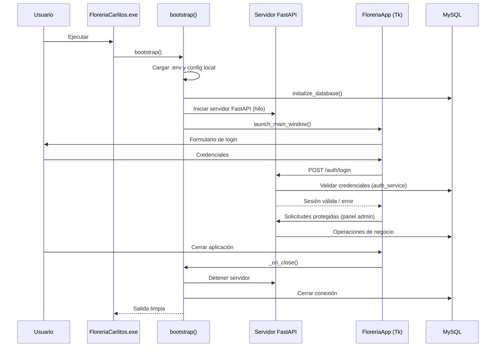

# Arquitectura de la aplicación de escritorio

## Puntos de entrada y dependencias
- `bootstrap()` configura el *logging*, carga variables de entorno opcionalmente con `python-dotenv`, lee la configuración local y crea la conexión MySQL antes de lanzar la interfaz. Depende de utilidades para branding, carga de configuración y manejo de errores de UI.【F:desktop_app/main.py†L493-L523】
- `open_db_connection()` interpreta el DSN, asegura el *schema* objetivo y delega a `initialize_database()` para preparar la base de datos antes de abrir la conexión utilizada por la aplicación.【F:desktop_app/main.py†L466-L483】【F:desktop_app/main.py†L29-L43】
- `FloreriaApp` encapsula la interfaz Tkinter y orquesta autenticación, navegación y diálogos administrativos apoyándose en servicios (`auth_service`, `user_service`, `audit_service`) y componentes de UI (`MainWindow`, `InitialAdminDialog`, `ui_theme`).【F:desktop_app/main.py†L49-L415】

## Estrategia de comunicación propuesta
Se propone mantener un solo proceso que inicializa un servidor FastAPI embebido (ejecutado con Uvicorn en un hilo de fondo) para exponer el backend y un cliente Tkinter que interactúa vía peticiones HTTP locales. Esta opción permite:
- Compartir el mismo intérprete empaquetado, evitando distribuir ejecutables separados.
- Definir límites claros entre frontend y backend reutilizando los servicios existentes como dependencias de las rutas FastAPI.
- Facilitar pruebas automatizadas y la futura sustitución del cliente (por ejemplo, un frontend web) sin alterar la lógica de negocio.

### Ciclo de vida de procesos
1. El ejecutable `FloreriaCarlitos.exe` inicia `bootstrap()` (vía PyInstaller) y prepara configuración y conexión a la base de datos.【F:desktop_app/build_exe.py†L10-L27】【F:desktop_app/main.py†L493-L523】
2. Antes de mostrar la UI, `bootstrap()` levanta el servidor FastAPI en un hilo dedicado; las rutas reutilizan `auth_service`, `user_service` y demás servicios existentes.
3. `launch_main_window()` crea `FloreriaApp`, que renderiza la vista de login y maneja la navegación mediante Tkinter.【F:desktop_app/main.py†L486-L521】
4. Las acciones del usuario (login, apertura de panel administrador, etc.) se traducen en solicitudes HTTP contra el backend embebido, que a su vez usa los repositorios y servicios actuales para acceder a MySQL.
5. Al cerrar la aplicación, `FloreriaApp._on_close()` cierra la sesión activa y `bootstrap()` detiene el servidor FastAPI antes de finalizar el proceso.【F:desktop_app/main.py†L410-L415】

## Diagrama de secuencia

## Compatibilidad con empaquetado en un solo `.exe`
`build_exe.py` usa PyInstaller con la opción `--onefile`, lo que integra todas las dependencias en un único ejecutable.【F:desktop_app/build_exe.py†L17-L27】 Al mantener el backend FastAPI dentro del mismo proceso, no se requieren ejecutables adicionales. Para soportar esta arquitectura basta con:
- Incluir las dependencias web (`fastapi`, `uvicorn`, cliente HTTP) en `requirements.txt` para que PyInstaller las detecte.
- Asegurarse de que la inicialización/detención del servidor FastAPI se ejecute desde `bootstrap()` antes y después del ciclo principal de Tkinter, evitando procesos huérfanos.
- Declarar archivos estáticos o plantillas (si los hubiera) mediante opciones de PyInstaller (`--add-data`) para que queden embebidos en el paquete resultante.
