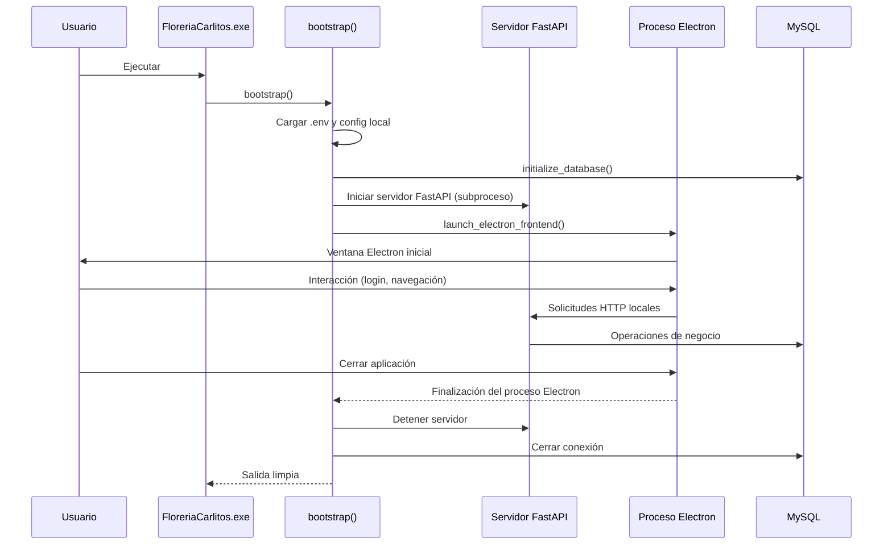

# Arquitectura de la aplicación de escritorio

## Puntos de entrada y dependencias
- `bootstrap()` configura el *logging*, carga variables de entorno opcionalmente con `python-dotenv`, lee la configuración local y abre la conexión MySQL antes de lanzar los subprocesos del backend y del frontend Electron.【F:desktop_app/main.py†L120-L218】
- `open_db_connection()` interpreta el DSN, asegura el *schema* objetivo y delega a `initialize_database()` para preparar la base de datos antes de abrir la conexión utilizada por la aplicación.【F:desktop_app/main.py†L64-L113】
- `launch_backend_process()` inicia el servidor FastAPI que expone los endpoints consumidos por el cliente Electron.【F:desktop_app/main.py†L116-L150】
- `launch_electron_frontend()` resuelve el modo de ejecución (desarrollo o empaquetado), prepara las variables de entorno y espera la finalización del proceso Electron.【F:desktop_app/main.py†L153-L214】

## Estrategia de comunicación actual
La aplicación utiliza un único ejecutable Python que arranca dos procesos coordinados:
- Un servidor FastAPI (lanzado mediante `launch_backend_process()`) que reutiliza los servicios existentes para exponer endpoints HTTP locales.
- Un proceso Electron que carga la interfaz React y se comunica con el backend mediante solicitudes HTTP y variables de entorno compartidas.

Esta separación permite mantener la lógica de negocio en Python y evolucionar la interfaz de usuario de forma independiente.

### Ciclo de vida de procesos
1. El ejecutable `FloreriaCarlitos.exe` inicia `bootstrap()` (vía PyInstaller) y prepara configuración y conexión a la base de datos.【F:desktop_app/build_exe.py†L10-L27】【F:desktop_app/main.py†L120-L218】
2. `bootstrap()` levanta el servidor FastAPI mediante `launch_backend_process()` y mantiene la referencia al proceso hijo para controlarlo.【F:desktop_app/main.py†L116-L150】【F:desktop_app/main.py†L183-L214】
3. A continuación, `bootstrap()` invoca `launch_electron_frontend()` para iniciar la ventana de Electron. El proceso permanece bloqueado hasta que la interfaz finaliza.【F:desktop_app/main.py†L153-L214】
4. Las acciones del usuario (login, paneles, etc.) se traducen en solicitudes HTTP hacia el backend, que reutiliza los servicios Python existentes para acceder a MySQL.
5. Al cerrar la aplicación, `bootstrap()` detecta la finalización del frontend y solicita el cierre del proceso FastAPI antes de terminar limpiamente.【F:desktop_app/main.py†L183-L214】

## Diagrama de secuencia

## Compatibilidad con empaquetado en un solo `.exe`
`build_exe.py` usa PyInstaller con la opción `--onefile`, lo que integra todas las dependencias en un único ejecutable.【F:desktop_app/build_exe.py†L17-L27】 Para soportar la arquitectura actual se recomienda:
- Incluir las dependencias web (`fastapi`, `uvicorn`, cliente HTTP) en `requirements.txt` para que PyInstaller las detecte.
- Distribuir junto al ejecutable el paquete de la app Electron generado en `frontend_electron` (por ejemplo, con `electron-builder`).
- Gestionar el ciclo de vida de los subprocesos desde `bootstrap()` para evitar procesos huérfanos cuando Electron o el backend se cierren de forma inesperada.【F:desktop_app/main.py†L183-L214】
